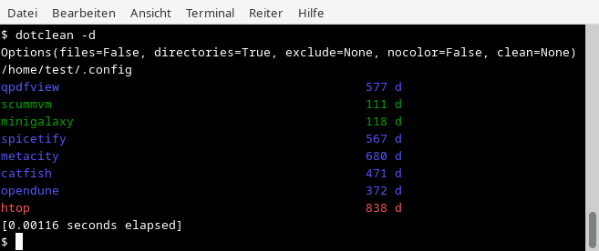
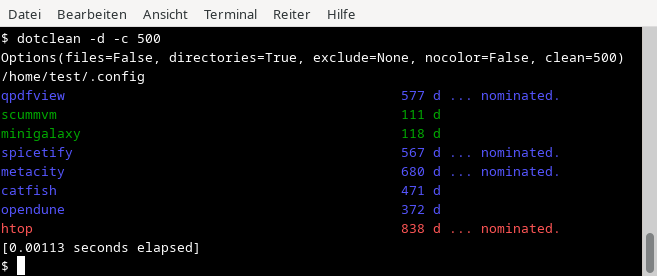
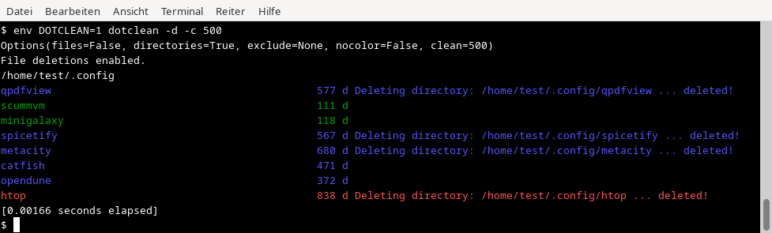

# DotClean - List and clean old or unused dotfiles/dotdirs

#### Installation

Steps assume that `python` (>=3.6) and `pip` are already installed.

    $ pip install DotClean

Install directly from ``github``:

    $ pip install git+https://github.com/amstelchen/DotClean#egg=DotClean

When completed, run it with:

    $ dotclean [...]

#### Usage

#### Safety feature

Setting the environment variable `DOTCLEAN` enables the program to really wipe entire files and directories, even if they are not empty. __USE WITH CAUTION!__

#### Examples

Listing directories in ~/.config:

Set a limit in days on files which are quite old:

Set `env DOTCLEAN=1` to arm the file deleter:

